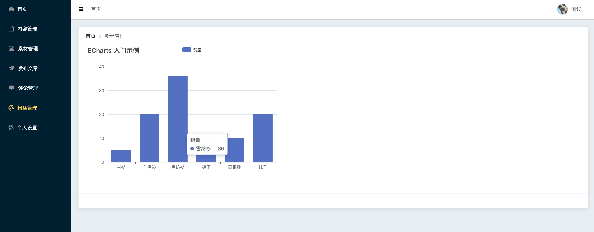

# toutiao_admin
> 本项目为 头条自媒体管理端


## 功能架构

多平台业务体系，还原企业真实业务场景，让你掌握复杂业务逻辑的技术实现技巧，开发事半功倍

+ 登录 / 注册
+ 用户个人信息管理
+ 频道编辑 | 频道分类
+ 文章加载 | 下拉刷新推荐
+ 文章详情
  + 评论管理 | 点赞 | 回复
+ 个人主页
  + 用户页面 | 个人信息 | 资料修改
+ 关于 | 粉丝
+ 收藏 | 历史

## 技术详情

+ 用户端基于开源社区热度很高的vue移动组件库Vant作为移动基础组件库，极大提高移动端交互及组件的开发效率。

+ 手势交互模型处理

  移动端特定手势的交互开发，上拉加载，下拉刷新的业务模型数据处理。

+ 信息流模型处理

  Feed信息流业务中新闻资讯类特定模式处理，时间戳分页模型的处理。

+ 认证鉴权方案

  基于 JWT 的 Token 认证方案，鉴定Token及Token换取的典型业务处理。

+ 脚手架方案

  基于 Vue CLI 的脚手架工具基础标准化的方案。


## 技术架构

### 架构支撑

+ 路由管理 Vue Router
+ 状态管理 Vuex
+ 服务端通信 Axios
+ 第三方插件
+ MVVM框架 VueJS
+ UI组件库 Vant


### 工具支持

+ 脚手架工具 Vue.Cli
+ 构建工具 webpack
+ 代码校验工具 ESlint


## 解决方案

+ Vuex持久化

  Vuex集中式状态管理，使原来多层级组件传值的问题 得到解决持久化的思路解决web端浏览器刷新之后的弊端，形成前端缓存分模块状态，让大型项目中的数据管理更加轻松

+ Token鉴定

  解决Token失效时跳到登录页的问题用户在无感情况下自动处理Token失效问题 保证安全的同时及时处理相关业务

+ Vant组件手势操作

  主流的移动App手势交互解决方案

+ 请求器拦截应用

  统一处理Token的统一注入

  统一处理所有的返回数据解构

  统一处理所有的代码异常及后续

  更优雅的异步编程方式


## **项目功能介绍**

**具体功能看预览地址！！！**

### **内容管理**  ✅

 实现自媒体用户对内容的全方位管控，查找筛选、文章上下架...各类功能一应俱全


主要功能：

1. 查询当前用户发布的所有文章
2. 根据文章状态  |  文章频道 |  发布时间  进行高级查询
3. 删除文章
4. 编辑文章


### 内容发布 ✅

高度智能的富文本编辑器、文章、视频、话题，各类内容一键发布，轻松快捷


主要功能：

1. 发布对应文章
2. 封面的多类型选择： 单图 | 三图 | 无图 | 自动
3. 富文本插件： `element-tiptap`


### **粉丝管理** ✅

粉丝情况全了解，从关注到私聊一站解决，实现粉丝闭环管理



+ 图文数据 （ 粉丝增长数、粉丝阅读量  ）
+ 粉丝概况 （粉丝数量、 粉丝性别分布、粉丝地区分布、 粉丝列表）

**该模块为重点加分模块！！！**


### **评论管理** ✅

舆论管控，了解文章风评，实时调整文案，提升好评率，做好口碑营销第一步


**实现对文章的评论开启与关闭**


### **素材管理** ✅

重要素材在线管理，10+素材同步上传，发布文章拿来即用，方便快捷


+ 素材列表
+ 素材收藏
+ 上传素材


### **个人设置**  ✅

设置个人资料介绍、邮箱、以及头像


+ 加分项： 增加头像的裁剪功能


## 启动项目 
``` npm run serve ```


## 预览地址

http://back.zeng.pub/toutiao/admin/


登录账号: 13911111111 || 15127228521 || 18530912651 || 18004081602 || 18101077610
验证码: 246810


## 接口文档

https://www.showdoc.com.cn/mouzhacu/7933067829372067